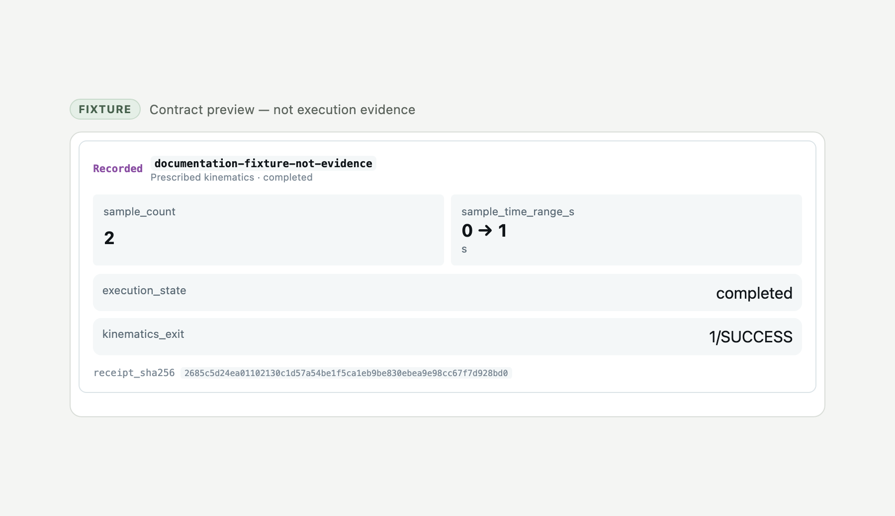

# Casys MCP Chrono

[](https://jsr.io/@casys/mcp-chrono)
[](https://github.com/superWorldSavior/mcp-chrono/actions/workflows/ci.yml)

A focused MCP provider for explicit prescribed rigid-body kinematics with
[Project Chrono](https://projectchrono.org/). It records the exact case bytes, runs a
fixed PyChrono adapter, and returns factual observations with content-addressed
provenance.



> The image is generated from a contract-valid documentation fixture. It demonstrates
> the MCP App presentation only; it is not a native execution, engineering proof, or
> product verdict.

## What it does

- accepts a closed SI kinematics case with explicit bodies, reference poses and revolute
  angle motors;
- stores cases and recorded runs under immutable SHA-256 identities;
- preserves literal engine observations, including non-convergence;
- exposes one compact MCP App component for an exact recorded run;
- works over MCP stdio or authenticated HTTP in the native container.

The provider does **not** infer joints from CAD or SysML, execute caller-provided code,
or evaluate contact, forces, dynamics, strength, safety or product fitness. A successful
native kinematics exit is not a product decision.

## Quick start

For an MCP host using stdio, run this package version:

```sh
deno run -A jsr:@casys/mcp-chrono@0.3.5/server --stdio
```

The native container includes the pinned Project Chrono runtime. Keep it on loopback,
use a long random bearer token and preserve `/data`. The GHCR version tag below is a
convenience pointer. Production deployments pin the immutable digest recorded after
publication in [the release documentation](docs/release.md); this README does not embed
a digest as a pre-publication assertion.

```sh
docker pull ghcr.io/casys-ai/mcp-chrono:0.3.5
docker volume create chrono-data
chrono_token="$(openssl rand -hex 32)"
docker run --rm \
  -e MCP_BEARER_TOKEN="$chrono_token" \
  -p 127.0.0.1:3025:3025 \
  -v chrono-data:/data \
  --cap-drop=ALL --security-opt no-new-privileges:true \
  ghcr.io/casys-ai/mcp-chrono:0.3.5
```

The endpoint is `http://127.0.0.1:3025/mcp` and requires
`Authorization: Bearer <token>`.

## Documentation

- [Start with the case and receipt contract](docs/contract.md)
- [Embed the recorded-run MCP App](docs/viewer.md)
- [Run from source or deploy the container](docs/deployment.md)
- [Understand the native adapter boundary](docs/native-adapter.md)
- [Review release and registry evidence](docs/release.md)
- [Contribute safely](CONTRIBUTING.md)

## Development

```sh
deno task release:check
```

Viewer HTML is generated, not hand-edited. The exact rebuild procedure and pinned MCP
View dependencies live in [the viewer documentation](docs/viewer.md).

## License

The source is MIT. The OCI image is an aggregate distribution; see
[third-party notices](THIRD_PARTY_NOTICES.md), the pinned Conda inventory and the image
SBOM/provenance attestations.
