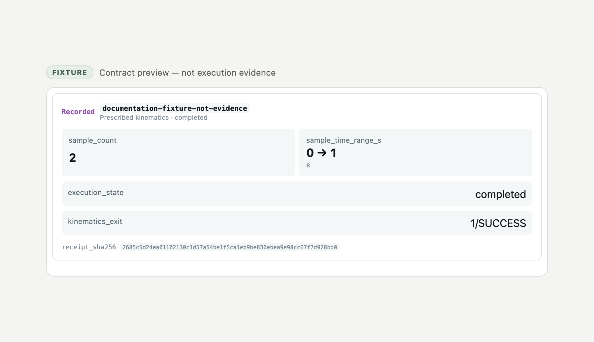

# Recorded-run MCP App

The provider owns one small business component, `chrono.recorded-run`. It presents one
recorded prescribed-kinematics identity with the literal sample range, execution state,
native kinematics exit and receipt provenance. It is intentionally a component-sized
view, not an application dashboard.

The generated single-file resource is registered at:

```text
ui://mcp-chrono/run-record-viewer
```

Hosts can discover the serialized App manifest at `ui://mcp-chrono/app-manifest`. The
whole view accepts `viewer.session.apply` with the provider-owned
`io.casys.mcp-chrono.recorded-run-session/1.0` envelope. That envelope joins the exact
request, case, outcome and canonical receipt fingerprints; it does not presume a Digital
Thread project or operation shape.

The provider also keeps structured JSON and text fallbacks for hosts without MCP Apps.

## Documentation preview



The preview is deliberately labelled `Fixture`. Its source session is
[`recorded-run-session.demo.json`](fixtures/recorded-run-session.demo.json), is parsed
by the production session validator during tests, and carries the request identity
`documentation-fixture-not-evidence`. The preview is presentation evidence only.

To regenerate the deterministic fixture:

```sh
deno task docs:viewer-fixture
```

Serve the repository root and open [`viewer-preview.html`](fixtures/viewer-preview.html)
to exercise the actual committed viewer bundle through an MCP Apps handshake and
`viewer.session.apply` event.

## Rebuilding the bundle

The HTML under `src/ui/dist/` is generated. Use the audited split packages from
`Casys-AI/mcp-server` commit `0629f67179868c9f17a3fb6705da32fdfcbcc216`:

```sh
export MCP_VIEW_LOCAL_ROOT=/absolute/path/to/mcp-server/packages/view
export MCP_VIEW_CONTRACTS_LOCAL_ROOT=/absolute/path/to/mcp-server/packages/view-contracts
export MCP_VIEW_COMPONENTS_LOCAL_ROOT=/absolute/path/to/mcp-server/packages/view-components
deno task build:ui
deno task check:ui:bundle
```

There is no published compatibility fallback for these local rebuild roots. Missing or
mismatched roots fail closed. Commit the rebuilt single-file HTML whenever viewer source
changes.
